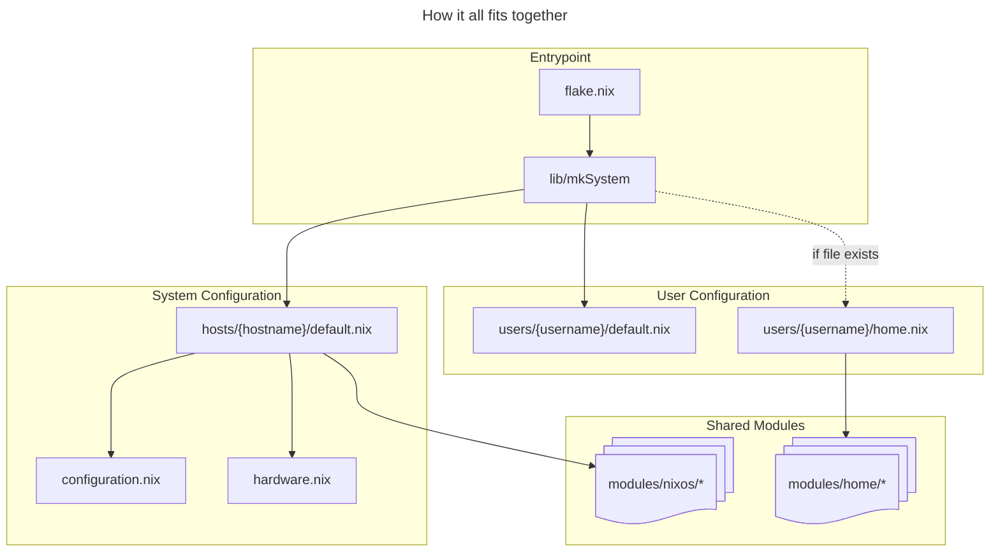
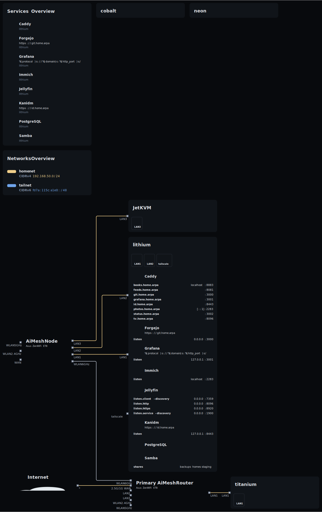

# nixos-config

> Declarative, reproducible configuration for all my NixOS systems
> Covers workstation/gaming, laptop, and homelab/server use cases.

## Overview

This repository manages **multiple NixOS systems** using a shared modular configuration.
It's designed to be **secure, composable, and automated** using modern Nix tooling.

- **Laptop ("neon")**: Portable KVM/Swiss-Army Knife
- **Homelab Server ("lithium")**: Identity, Backups, Forgejo, Jellyfin
- **Workstation / Gaming ("titanium")**: Dev and Gaming /w Steam/Proton
- Secrets managed via `sops-nix`
- Deployable with `nixos-rebuild` (and soon `deploy-rs` or `nixos-anywhere`)

Goofing
```bash
nix --extra-experimental-features repl-flake repl ".#nixosConfigurations.titanium"
nix repl --expr "builtins.getFlake \"$PWD\""
```



## How to use this? (Deployment)

With [home-manager](https://github.com/nix-community/home-manager) included as
an input to the flake, and pulled into the hosts along with their users, this
will automatically apply updates to both the system and user environments.


```bash
# This will show what the flake has to offer.
nix flake show

# Build a VM to test config
nixos-rebuild build-vm --flake .#hostname

# Preview and apply changes on a nixOS system
nixos-rebuild dry-run --flake .#hostname
sudo nixos-rebuild switch --flake .#hostname

# Preview and apply changes on a macOS system
darwin-rebuild dry-run --flake .#hostname
darwin-rebuild switch --flake .#hostname

# Generate an Install ISO
nix build .#nixosConfigurations.installIso.config.system.build.images.iso

# Verify the ISO contents
sudo mount -o loop result/iso/nixos-*.iso mnt
ls mnt
umount mnt

# Generate Service and Network Topology Diagrams
nix build .#topology.x86_64-linux.config.output
```

## Design Goals

- **Reproducibility**: All systems can be rebuilt from this repo
- **Modularity**: Every services is a reusable module
- **Security**: Minimal trust, secrets managed explicitly
- **Composability**: Roles + services enable rapid provisioning

## Directory Layout / Organization

```
├── flake.nix  # sets inputs, imports lib functions, wires hosts and users
├── lib        # functions to build flake outputs
├── hosts
│   ├── <hostname>
│   │   ├── configuration.nix  # imports from ../../modules/nixos
│   │   ├── hardware.nix       # host specific hardware configuration
│   │   └── default.nix        # entrypoint for host configuration
├── users
│   ├── <username>
│   │   ├── default.nix  # entrypoint for user configuration
│   │   └── home.nix     # imports from ../../modules/home/
├── modules    # Reusable NixOS and Home-Manager Modules
│   ├── nixos  # host configuration modules
│   └── home   # home-manager modules
├── overlays   # Custom Nixpkgs overlays that modify existing pacakges.
└── pkgs       # Custom Nix packages (not in nixpkgs)

```

## Topology



## References

- [@shazow](https://github.com/shazow/) and https://github.com/shazow/nixfiles/
- [@ryan4yin] and the contributors and co-authors of [nixos-and-flakes-book](https://nixos-and-flakes.thiscute.world/)
- [@Mic92] for https://github.com/Mic92/sops-nix and https://blog.thalheim.io/
- Various GitHub Projects found with searches [similar to this](https://github.com/search?q=language%3ANix+sops-nix.nixosModules.sops&type=code)
- https://nix.dev/ and https://search.nixos.org/
- https://edolstra.github.io/pubs/phd-thesis.pdf
